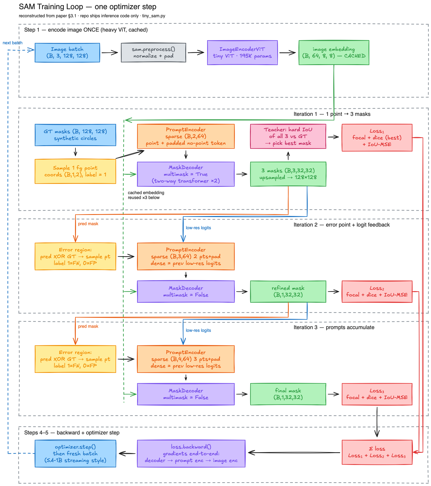

# SAM Training Loop — Step-by-Step Walkthrough

A companion guide to [`tiny_sam.py`](tiny_sam.py), which simulates
one complete SAM training step on synthetic data.

> **Why a demo file?** The official repo ships **inference code only** — there is no
> training script. `tiny_sam.py` reconstructs the training procedure from the
> paper (Kirillov et al., *"Segment Anything"*, ICCV 2023, §3.1 "Training"), shrunk so
> the full pipeline runs in seconds on a laptop.

## Run it

```bash
python3 -m venv .venv
.venv/bin/pip install torch numpy
.venv/bin/python tiny_sam.py
```

Expected output (abbreviated):

```
tiny SAM on cpu: 355,528 params  (encoder 195,456 | prompt 1,804 | decoder 158,268)
training all of it end-to-end, as in the paper

=== one training step, traced ===
  image          (4, 3, 128, 128) -> encoder ONCE -> (4, 64, 8, 8)
  it1 prompt     (4, 1, 2) xy -> sparse (4, 2, 64)  (2nd token is the auto-padded 'no-point' token, no box given)
  it1 decoder    multi-mask: low_res (4, 3, 32, 32), logits (4, 3, 128, 128), iou_pred (4, 3)
  it1 selected-mask mean IoU: 0.082
  it2 prompt     2 accumulated pts -> sparse (4, 3, 64), dense mask feedback (4, 64, 8, 8) -> single mask, mean IoU 0.086
  it3 prompt     3 accumulated pts -> sparse (4, 4, 64), dense mask feedback (4, 64, 8, 8) -> single mask, mean IoU 0.086

=== fresh synthetic batch every step (like streaming from SA-1B) ===
step  0  loss   2.652   IoU it1 0.119 -> it3 0.080   |grad| 1.74
step 19  loss   1.529   IoU it1 0.818 -> it3 0.816   |grad| 3.39
step 49  loss   0.286   IoU it1 0.859 -> it3 0.865   |grad| 1.00
step 99  loss   0.096   IoU it1 0.958 -> it3 0.960   |grad| 0.89
```

Mean IoU climbs from **0.08 → ~0.96 over 100 steps** on unseen images (already ~0.5 by
step 10) — the loop genuinely trains segmentation, from scratch.

---

## Architecture recap

```
                        ┌─────────────────────────┐
   image (128×128)  ──▶ │  Image Encoder (tiny ViT)│──▶ image embedding  B×64×8×8
                        │  run ONCE per image      │    (reused across all prompts)
                        └─────────────────────────┘
                                                          │
   points/boxes ──▶ PromptEncoder ──▶ sparse embeddings ──┤
   mask logits  ──▶ PromptEncoder ──▶ dense embeddings ───┤
                                                          ▼
                                          ┌───────────────────────────┐
                                          │  Mask Decoder             │──▶ masks + IoU scores
                                          │  2-layer two-way          │
                                          │  transformer, run per     │
                                          │  prompt iteration         │
                                          └───────────────────────────┘
```

The demo uses a **tiny SAM** (~355K params) with the *identical wiring* as
`segment_anything/build_sam.py` — just shrunken dims (128px input instead of 1024,
embedding dim 64 instead of 256/1280, ViT depth 2 instead of 32).

---

## Training loop diagram



*Color legend:* blue = data/IO · gray = preprocessing · purple = heavy/learned compute (encoder, decoder, backward) ·
yellow/orange = prompt sampling + PromptEncoder · green = cached embeddings & predicted masks · pink = teacher
signal · red = losses. The **green dashed rail** is the image embedding computed once and reused by all three decoders;
the **orange/blue feedback elbows** carry the predicted mask and its low-res logits from one iteration into the next
prompt; the **red right-margin lines** merge the three per-iteration losses into a single backward pass.

*Editable source:* [`assets/training_loop.excalidraw`](assets/training_loop.excalidraw) (open in Excalidraw or re-import
via the excalidraw skill to tweak).

---

## The training pipeline, step by step

### Step 1 — Encode the image once

`(B, 3, 128, 128)` images → normalize + pad (`sam.preprocess`, sam.py:164) →
`ImageEncoderViT` → embeddings `(B, 64, 8, 8)`.

This expensive pass happens **once per image**; the same embeddings feed all three
prompt iterations below. That asymmetry is SAM's core design — it's what makes both
interactive inference and iterative training cheap.

### Step 2 — Iteration 1: ambiguous prompt, multi-mask output

1. **Sample one random foreground point** per image from the GT mask →
   `coords (B, 1, 2)` in (x, y), labels all `1` (foreground).
2. `PromptEncoder` turns it into sparse tokens `(B, 2, 64)` — note the **2nd token is
   auto-padded**: with no box given, the encoder appends a learned "not-a-point" token
   (prompt_encoder.py:81–85).
3. `MaskDecoder` with `multimask_output=True` produces **3 masks** `(B, 3, 32, 32)`,
   upsampled to 128×128. These come from its 4 learnable output tokens: token 0 is for
   single-mask mode; tokens 1–3 are whole / part / subpart hypotheses.
4. A **teacher signal** picks the winner: compute the actual IoU of all 3 masks vs GT
   (`hard_iou`), supervise **only the best one** with focal + dice loss.
5. The **IoU head** gets an MSE loss against that mask's true IoU.
   This is crucial: *at inference there is no GT*, so the trained IoU head alone decides
   which of the 3 masks to return.

### Step 3 — Iterations 2–3: error-driven re-prompting

1. Compute the **error region**: `predicted_mask XOR gt_mask`.
2. Sample a new point from it — label **1** if the model missed object there
   (false negative), **0** if it hallucinated object (false positive).
3. **Accumulate** points into the prompt: sparse embeddings grow
   `(B,2,64) → (B,3,64) → (B,4,64)`.
4. Feed the previous iteration's low-res logits **back in as a dense mask prompt**
   `(B, 64, 8, 8)` — the model literally sees its last mistake.
5. Now `multimask_output=False` → a single refined mask. Supervise again.

This loop is the paper's "model-in-the-loop data engine" idea applied to training:
each round's mistakes become the next round's prompts.

### Steps 4–5 — One backward pass, end-to-end

All three iterations share the image embedding, so gradients from all 9 mask losses
flow back through the decoder, prompt encoder, **and** image encoder together.
Adam step, then repeat with a fresh batch — mimicking streaming from SA-1B.

### The losses (paper §3.1)

| Loss | Formula idea | Purpose |
|---|---|---|
| **Sigmoid focal** (α=.8, γ=2) | Down-weighted cross-entropy | Per-pixel mask classification; handles fg/bg imbalance |
| **Dice** | 1 − 2·intersection / (sum pred + sum gt) | Overlap-based; robust when the object is small |
| **IoU MSE** | (predicted IoU − true IoU)² | Trains the head that *ranks* masks at inference |

---

## A gotcha worth knowing

The demo's first run crashed inside `mask_decoder.py:127` (`tensor size 16 vs 4`).
The reason: **`MaskDecoder`'s batch dimension is the number of prompt hypotheses for
*one* image, not the number of images.** Internally it does
`repeat_interleave(image_embeddings, n_prompt_sets)`, which assumes the image batch
dim is 1.

That's exactly why `Sam.forward()` loops over images one-by-one (sam.py:101–117), and
why `SamPredictor.predict_torch()` calls `image_embeddings.unsqueeze(0)` before passing
several prompts at once. The demo's `decode()` helper mirrors that per-image loop.

---

## Faithful to the paper vs. simplified

| Faithful | Simplified |
|---|---|
| 3-iteration prompt sampling from error regions | Tiny model (355K params) vs ViT-H (632M) |
| Multi-mask → supervise best mask + IoU head | 128px images vs 1024px |
| Focal + dice + IoU MSE losses | Synthetic circles vs SA-1B (11M images, 1.1B masks) |
| Mask-logit feedback between iterations | Batch 4 / 100 steps vs batch 256 / 665K iterations |
| End-to-end training of encoder + decoder | Paper also uses 64 overlapping 300×300 crops per image, freezes the encoder late in training, and filters targets with a stability score |

---

## Experiments to deepen understanding

Try these small changes in `tiny_sam.py`:

- **`N_STEPS = 300`** — watch IoU saturate near 1.0 (the default 100 already reaches ~0.96);
  confirms it *learns*, not memorizes, since every step draws a fresh random image.
- **Freeze the encoder** — reproduces SAM's late-training stage:
  ```python
  for p in sam.image_encoder.parameters():
      p.requires_grad_(False)
  ```
  Note how much faster steps get: the encoder is ~55% of the params and most of the compute.
- **Box prompts** — boxes are unambiguous, so they skip the multi-mask stage:
  ```python
  from segment_anything.utils.amg import batched_mask_to_box
  boxes = batched_mask_to_box(gt)            # (B, 4) xyxy
  sparse, dense = sam.prompt_encoder(points=None, boxes=boxes, masks=None)
  ```
- **Remove the IoU loss** — the training loss still drops, but mask *selection* at
  inference (no GT available) breaks. This isolates exactly why the IoU head exists.

## Further reading

- Paper: [arXiv:2304.02643](https://arxiv.org/abs/2304.02643), §3.1 (training) and §3.2 (losses)
- `segment_anything/modeling/sam.py` — the inference `forward()`, structurally the same loop
- `segment_anything/automatic_mask_generator.py` — the "segment everything" pipeline that
  the error-region sampling in training is designed to support
